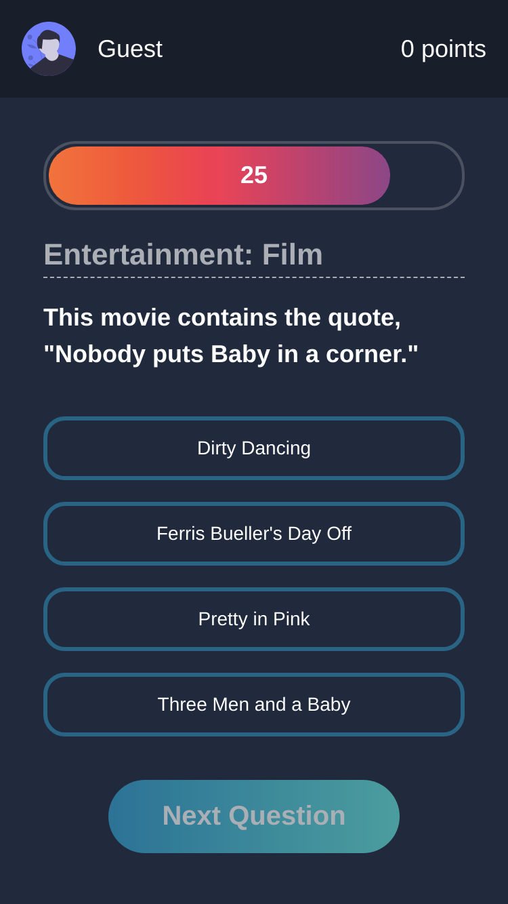

# Trivia API Quizz
<!-- [](https://github.com/adryanrosa/url-shortening-api-landing-page/blob/main/README.md) -->

This is a project from the Front-end module at Trybe

## Table of contents

- [Overview](#overview)
  - [Live site and instructions](#live-site-and-instructions)
  - [The challenge](#the-challenge)
  - [Screenshot](#screenshot)
- [My process](#my-process)
  - [Built with](#built-with)
  - [Useful resources](#useful-resources)
  <!-- - [O que aprendi](#o-que-aprendi)
  - [Desenvolvimento contínuo](#desenvolvimento-contínuo) -->
<!-- - [Autor](#autor) -->

## Overview

### Live site and instructions

- Please visit my application [at](https://quizz-adryanrosa.vercel.app/)
- Want to check it locally? Follow the steps
  1. Clone the repository
    * `git clone git@github.com:adryanrosa/quizz.git`
    * Enter the cloned repository folder:
     * `cd quizz`

  2. Install the dependencies and start the project
    * Install the dependencies:
     * `npm install`
    * Start the project:
     * `npm run dev` (a new tab should open in your default browser)

### The challenge

Users should be able to:

- Access the game page, where they must choose one of the answers available for each of the questions presented. The answer must be selected before the timer reaches zero, otherwise the answer must be considered wrong.
- Be redirected, after 5 answered questions, to the score screen, where the text shown depends on the number of correct answers.
- View the rankings, if they like to, at the end of each game.
- Configure the game options in a settings page accessible at the start of the game.

### Screenshot



## My process

### Built with

- [Next.js](https://nextjs.org/) - React Framework
- [Redux](https://redux.js.org/) - Global state management library
- [styled-components](https://styled-components.com/) - CSS in JS library
- [Trivia API](https://opentdb.com/api_config.php) - REST API
- Mobile-first Workflow

### Useful resources

- [Styled Components - Where to begin](https://www.youtube.com/watch?v=QdfjWRc4ySA&t=1049s)
- [How to structure a Next, Styled Components project](https://www.youtube.com/watch?v=mJK5oGixSYo)

<!-- ### O que aprendi

Use this section to recap over some of your major learnings while working through this project. Writing these out and providing code samples of areas you want to highlight is a great way to reinforce your own knowledge.

To see how you can add code snippets, see below:

```html
<h1>Some HTML code I'm proud of</h1>
```
```css
.proud-of-this-css {
  color: papayawhip;
}
```
```js
const proudOfThisFunc = () => {
  console.log('🎉')
}
```

### Desenvolvimento contínuo

Use this section to outline areas that you want to continue focusing on in future projects. These could be concepts you're still not completely comfortable with or techniques you found useful that you want to refine and perfect. -->

<!-- ## Autor

- Website - [Add your name here](https://www.your-site.com)
- Frontend Mentor - [@yourusername](https://www.frontendmentor.io/profile/yourusername)
- Twitter - [@yourusername](https://www.twitter.com/yourusername) -->
